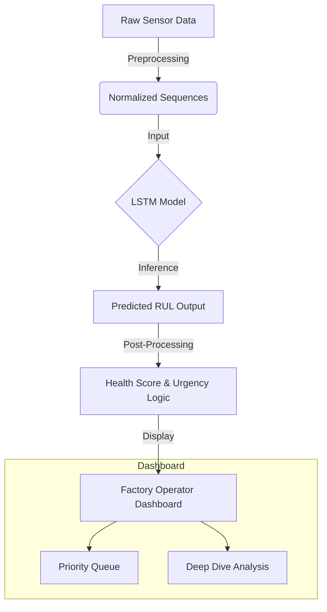

# 🚀 Aircraft Engine RUL Prediction & Monitoring

A Predictive Maintenance system that estimates the **Remaining Useful Life (RUL)** of aircraft engines using Deep Learning (LSTM) and provides a real-time monitoring dashboard for factory operators.

## 📖 Project Overview

This project aims to prevent engine failures by predicting exactly when maintenance is required. It utilizes sensor data from the **NASA C-MAPSS Turbofan Degradation Dataset** to train a Long Short-Term Memory (LSTM) neural network. A user-friendly **Streamlit Dashboard** visualizes the health status, urgency, and estimated failure time for each engine.

## ⚙️ Working Principle

The system operates in three main stages:

### 1. Data Processing
*   **Input**: Time-series data from 21 engine sensors (Temperature, Pressure, Fan Speed, etc.).
*   **Preprocessing**:
    *   **Normalization**: Scaling features to a 0-1 range using MinMaxScalers (saved in `scaler.pkl`).
    *   **Sequence Generation**: Creating sliding time-windows (Sequence Length: 30 cycles) to feed into the LSTM.
    *   **RUL Labeling**: Training data is labeled with a piece-wise linear RUL target (capped at `MAX_RUL` to improve learning stability).

### 2. The Model (LSTM)
We use a **Long Short-Term Memory (LSTM)** network built with **PyTorch**.
*   **Architecture**:
    *   2 LSTM Layers (Hidden Dimension: 64) to capture temporal dependencies in sensor degradation patterns.
    *   Dropout Layer (0.2) for regularization.
    *   Fully Connected (Dense) Output Layer to regress the final RUL value.
*   The model learns to map the sequence of recent sensor readings ~to~ the number of remaining operational cycles.

### 3. Real-Time Inference & UI
*   **Streamlit Application**: Loads the trained model (`lstm_model.pkl`) and configuration.
*   **Visualization**:
    *   Converts raw RUL predictions into actionable metrics (Health %, Estimated Days Remaining).
    *   Classifies engines into **Good (🟢), Fair (🟡), Poor (🟠), and Critical (🔴)** states.
    *   Prioritizes maintenance queues to help operators focus on urgent repairs.

## 🔄 Project Flow



## 🛠️ Tech Stack

*   **Core**: Python
*   **Machine Learning**: PyTorch, Scikit-learn, Pandas, NumPy
*   **Visualization**: Streamlit, Plotly
*   **Data**: NASA C-MAPSS Dataset (FD001)

## 🚀 How to Run

1.  **Install Dependencies**:
    ```bash
    pip install -r requirements.txt
    ```
    *(Ensure you have `torch`, `streamlit`, `pandas`, `plotly`, `numpy`, `scikit-learn` installed)*

2.  **Run the Dashboard**:
    ```bash
    streamlit run app.py
    ```

3.  Access the web interface at `http://localhost:8501`.

## 📂 File Structure

*   `app.py`: Main Streamlit application entry point.
*   `lstm_model.pkl`: Trained PyTorch model.
*   `scaler.pkl`: Saved scalar object for data normalization.
*   `app_config.json`: Configuration settings (features, sequence length).
*   `lstm.ipynb`: Notebook used for training the model.
*   `train_FD001.txt` / `test_FD001.txt`: Dataset files.

## ⚠️ Maintenance Alerts
The system automatically flags engines with **<25% Health** as **CRITICAL**, advising immediate maintenance to prevent catastrophic failure.
